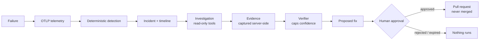

<div align="center">

# OpsPilot

**An evidence-first AI SRE: from a real failure to a reviewed fix, with every claim traceable.**

[](https://github.com/Okkahai/SREAgent/actions/workflows/ci.yml)


</div>

OpsPilot answers one question: **what failed, why, what evidence supports that, and how should it be fixed?** It detects incidents deterministically, gathers evidence from telemetry and code, lets an investigator (LLM or built-in rules) propose hypotheses, and turns them into fixes that only run after a human approves.



## What makes it different

| Principle | How it is enforced |
|-----------|--------------------|
| **No unsupported claims** | Every statement is labelled `OBSERVATION`, `HYPOTHESIS` or `CONFIRMED_FACT`. The model can only cite evidence ids that the server captured itself; a deterministic verifier drops the rest and caps confidence by how much independent evidence exists. The AI can never assert `CONFIRMED_FACT`. |
| **Deploys are correlation, not blame** | A deployment hypothesis needs deployment evidence, and a code or config cause needs the actual commit diff. A dependency outage is not blamed on the last release. |
| **Detection needs no AI** | Error rate, p95 latency and DB pool saturation rules run every 15 s and drive an incident state machine with dedupe and recovery. |
| **Safe by construction** | Integrations are read-only first. The only executable action is opening a pull request; approval is bound to the exact payload hash, a kill switch is off by default, and audit rows cannot be edited. |
| **Prompt-injection aware** | Logs and commit text reach the model only as `untrusted_data`, secrets are redacted before leaving, and the model has no write tools at all. |
| **Real data only** | No mocked intelligence: the dashboard and the CI scenario run against genuine telemetry from a demo app with injectable faults. |

## Quickstart

You need Docker. The whole demo (gateway, checkout, payments, a database, a load generator and OpsPilot itself) starts with one command.

```bash
git clone https://github.com/Okkahai/SREAgent && cd SREAgent
cp .env.example .env                      # Windows: copy .env.example .env
echo OPSPILOT_INVESTIGATOR=rules >> .env  # no API key needed (see "Investigators")
docker compose --profile demo up -d --build --wait
```

Open the dashboard at **http://localhost:3000**, then break something:

```bash
scripts/fault.sh checkout set http_500 '{"rate":0.6}'   # about 60% of checkouts fail
scripts/fault.sh checkout clear                          # revert
scripts/deploy.sh bad                                    # real redeploy: v1.1.0 with DB pool 20 -> 2
scripts/deploy.sh good                                   # roll back to v1.0.0
make demo-check                                          # the full automated failure-injection scenario
```

An incident appears within a couple of minutes, with its timeline, evidence and investigation. Other faults: `payments set down`, `checkout set db_timeout`, `checkout set memory_spike '{"mb":300}'`. Every fault changes real behaviour, so the telemetry is genuine ([demo/README.md](demo/README.md)).

| Service | Address |
|---------|---------|
| Dashboard | http://localhost:3000 |
| API + docs | http://localhost:8000 (`/healthz`, `/readyz`, `/docs`) |
| OTLP ingest | `localhost:4317` (gRPC), `localhost:4318` (HTTP) |

Port already taken? See [Troubleshooting](#troubleshooting). Shell scripts need Git Bash or WSL on Windows.

## Investigators

| Mode (`OPSPILOT_INVESTIGATOR`) | Needs | What it does |
|--------------------------------|-------|--------------|
| `llm` (default) | `ANTHROPIC_API_KEY` | A bounded loop of read-only tools with a model that proposes hypotheses. Without a key or if the provider is down, the investigation is recorded as `FAILED` and retried up to 3 times; detection is unaffected. |
| `rules` | nothing | Built-in rules over the same tools. Reports three patterns as hypotheses: a saturated DB pool, errors concentrated in the newly deployed version (a correlation), and failures dominated by an outbound dependency call. No free-form reasoning, no code analysis, no actions. Anything else ends as inconclusive with unknowns listed. |
| `auto` | optional key | `llm` when a key is set, otherwise `rules`. |

Both go through the same evidence capture and verifier. Details: [docs/07](docs/07-ai-agent-responsibilities.md).

## From hypothesis to pull request

After a verified hypothesis the investigator may recommend actions. A deterministic policy table (`backend/src/opspilot/domain/policy.py`) assigns risk, not the model:

| Action | Risk | OpsPilot can execute |
|--------|------|----------------------|
| `OPEN_PR` | LOW | yes, after approval |
| `ROLLBACK`, `RESTART`, `SCALE`, `CONFIG_CHANGE` | HIGH | no, a runbook a human performs |
| `MERGE_PR`, database and infrastructure changes | DESTRUCTIVE | refused |

```bash
# 1. read the proposal and its payload hash
curl localhost:8000/v1/incidents/INC-0001/proposals
# 2. approve exactly that payload
curl -H "Authorization: Bearer $OPSPILOT_APPROVER_TOKEN" -H "X-OpsPilot-Actor: you" \
     -H 'content-type: application/json' \
     -d '{"decision":"APPROVE","payload_hash":"<hash>"}' localhost:8000/v1/proposals/<id>/decision
# 3. execute (opens an opspilot/... branch and a PR, never merges)
curl -X POST -H "Authorization: Bearer $OPSPILOT_APPROVER_TOKEN" -H "X-OpsPilot-Actor: you" \
     localhost:8000/v1/proposals/<id>/execute
```

Execution also needs `OPSPILOT_ACTIONS_ENABLED=true` and a separate `GITHUB_WRITE_TOKEN`. Proposals expire after 60 minutes. The dashboard is read-only, so approvals go through the API.

## Configuration

Copy `.env.example` to `.env`. The settings that matter most:

| Variable | Purpose |
|----------|---------|
| `OPSPILOT_INVESTIGATOR` | `llm`, `rules` or `auto` (see above) |
| `ANTHROPIC_API_KEY`, `LLM_MODEL` | model investigator |
| `GITHUB_TOKEN`, `GITHUB_REPO` | read-only commit, diff and CODEOWNERS context (`commit_changes` tool) |
| `GITHUB_WEBHOOK_SECRET` | HMAC verification for `POST /v1/webhooks/github` (records CI runs) |
| `OPSPILOT_INGEST_TOKEN` | bearer token for OTLP ingest and `POST /v1/deployments` |
| `OPSPILOT_VIEWER_TOKEN` | optional: require a token for read APIs (the dashboard sends it server-side); empty means reads are open, for local use |
| `OPSPILOT_APPROVER_TOKEN` | approve, reject and execute proposals (also reads) |
| `OPSPILOT_ACTIONS_ENABLED`, `GITHUB_WRITE_TOKEN` | kill switch (default off) and the only write credential |
| `POSTGRES_HOST_PORT`, `REDIS_HOST_PORT`, `WEB_HOST_PORT`, `API_HOST_PORT` | move host ports on a clash |

## What is included

| Area | Delivered |
|------|-----------|
| Ingestion | OTLP/HTTP protobuf (gzip) into daily-partitioned Postgres, 7-day retention, service/version/commit/trace correlation, per-minute rollups |
| Detection | Celery beat rules, incident lifecycle (detected, investigating, identified, mitigating, monitoring, resolved, closed), MTTD/MTTR |
| Investigation | Read-only tools, server-side evidence, verifier, LLM or rule-based investigator |
| GitHub | Read-only commits, diffs, CODEOWNERS, CI runs via webhook; PR-only executor |
| Dashboard | Overview, incidents, incident detail (timeline, hypotheses linked to evidence, suspect commit, proposals, captured queries), services, deployments; live data with empty states |
| Deployment | Docker Compose; Kustomize with restricted Pod Security, default-deny NetworkPolicies, HPA and PDB, exercised on `kind` in CI ([deploy/k8s](deploy/k8s/README.md)) |
| Quality gates | Unit, integration and Playwright tests, an ingest load test, `import-linter` layering, `pip-audit`, `npm audit`, Trivy manifest scan, gitleaks, and the full failure scenario on every PR |

Measured on the ingest path: 10,000 log records with no loss at about 18k records/s in-process on one machine (CI requires 1k/s). That is a smoke check, not a capacity claim.

## Honest limits

- Investigations by a real model have only been tested with a scripted stand-in; no live accuracy, hallucination or cost numbers exist.
- The pull-request executor has only been exercised against a mocked GitHub.
- Access is shared bearer tokens (viewer, approver). There is no admin role, OIDC or per-user identity.
- Container images are not vulnerability-scanned in CI; Next.js 15 carries a build-time PostCSS advisory whose fix needs Next 16.
- The rule-based investigator recognises three patterns only.

The full accounting is in [docs/11-evaluation.md](docs/11-evaluation.md).

## Development

```bash
make up          # local stack without the demo shop
make test        # backend tests (INTEGRATION=1 make test also runs the database tests)
make lint        # ruff + mypy + import-linter (backend), eslint + tsc (web)
make demo-up     # stack plus demo shop and load generator
make kind-up kind-check kind-down   # deploy and verify on a local kind cluster
```

Backend needs Python 3.11 (`pip install -e 'backend[dev]'`), web needs Node 22 (`npm ci` in `web/`). Load test: `INTEGRATION=1 pytest tests/integration/test_ingest_load.py -s`.

## Documentation

| | |
|--|--|
| [01 Requirements](docs/01-requirements.md) | [06 Observability architecture](docs/06-observability-architecture.md) |
| [02 Architecture](docs/02-architecture.md) | [07 AI agent responsibilities](docs/07-ai-agent-responsibilities.md) |
| [03 Repository structure](docs/03-repository-structure.md) | [08 Security boundaries](docs/08-security-boundaries.md) |
| [04 Database schema](docs/04-database-schema.md) | [09 MVP acceptance criteria](docs/09-mvp-acceptance-criteria.md) |
| [05 Incident lifecycle](docs/05-incident-lifecycle.md) | [10 Roadmap](docs/10-roadmap.md) and [11 Evaluation](docs/11-evaluation.md) |

## Troubleshooting

- **`port is already allocated`** on 5432, 6379, 3000 or 8000: something else (often another project's Postgres or Redis container) holds it. Set `POSTGRES_HOST_PORT`, `REDIS_HOST_PORT`, `WEB_HOST_PORT` or `API_HOST_PORT` in `.env` (for example `REDIS_HOST_PORT=6380`) and run `docker compose --profile demo up -d --wait` again. Find the culprit with `docker ps --format "{{.Names}} {{.Ports}}"`. Containers reach each other on the internal network, so only host access changes.
- **API container exits right after a failed start**: run `docker compose --profile demo down` and start again; a half-created network from the failed attempt can leave it unable to resolve `postgres`.
- **Windows**: use `copy` instead of `cp`, and run `scripts/*.sh` from Git Bash or WSL. In plain cmd you can inject a fault with `curl -X PUT http://127.0.0.1:8081/_faults/http_500 -H "content-type: application/json" -d "{\"rate\":0.6}"`.
